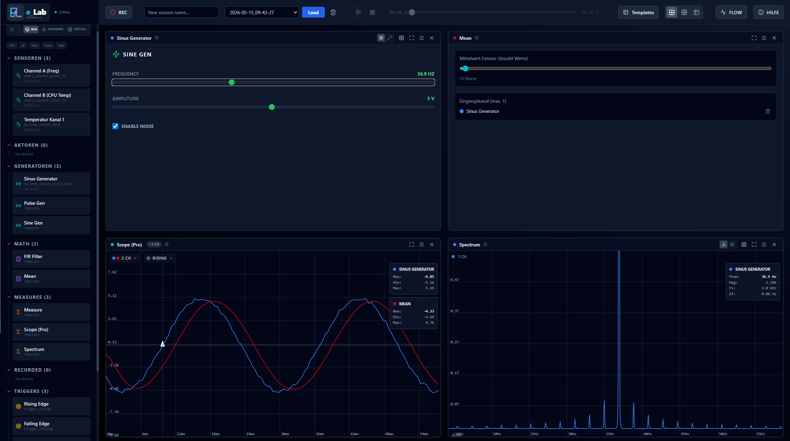
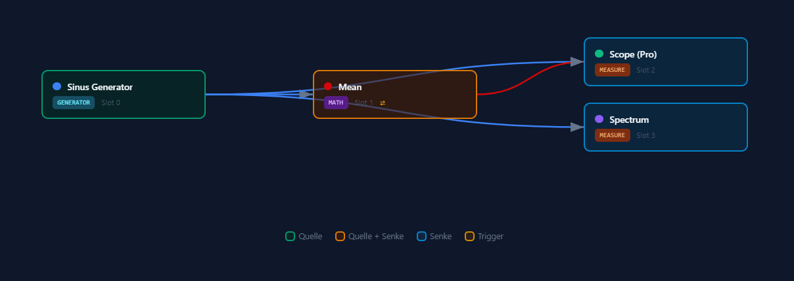

# e_Lab Core




e_Lab is a modern, distributed application designed to seamlessly connect hardware data sources (such as sensors and simulators) with web-based user interfaces. By utilizing a decoupled architecture consisting of a Python backend and a React frontend, e_Lab provides a highly flexible and dynamic environment for hardware monitoring and control.


## Go with the Flow

Follow the end-to-end data path from provider registration to live UI rendering and recording.



## ✨ Key Advantages & Features

### 1. Decoupled "Dispatcher" Architecture
At the core of e_Lab is the Dispatcher Pattern. The Python backend acts as a central hub that accepts registrations from hardware providers and forwards their real-time data streams to connected UI clients via Socket.IO. Neither the hardware providers nor the frontend clients need to know about each other, ensuring a highly scalable and loosely coupled system.

📖 **[Learn more →](doc/overview.md#dispatcher-architecture)**

### 2. Zero-Config & Auto-Discovery
Adding new hardware to the e_Lab system is effortless. Hardware clients automatically find the Dispatcher server on the network via UDP discovery. This "Zero-Config" process eliminates the need for manual IP configuration and allows for instant plug-and-play functionality.

📖 **[Learn more →](doc/overview.md#zero-config-discovery)**

### 3. Dynamic Manifest-Based Registration
e_Lab does not require the frontend to have prior knowledge of the connected hardware. Each provider describes its capabilities—such as tasks, data types, and rendering instructions—through a JSON Manifest. This allows the React application to dynamically build appropriate and fully functional visualizations for unknown hardware on the fly.

📖 **[Learn more →](doc/schema_reference.md)** | **[API Reference →](doc/api.md)**

### 4. Remote UI Injection (Custom Plugins)
For highly specialized hardware, standard widgets might not be enough. A standout feature of e_Lab is **Remote UI Injection**: hardware providers can supply their own custom UI components (JavaScript/React files) bundled directly with the device. The React frontend dynamically loads and renders these components at runtime without requiring a rebuild of the frontend.

📖 **[Plugin Development Guide →](doc/plugin_development.md)** | **[UI Reference →](doc/ui_reference.md)**

### 5. Session Recording & Live Replay
The Dispatcher can record all system communication—including registrations, data streams, and control commands—into an SQLite session database. These recorded sessions can be loaded and played back at any time. During playback, the system behaves exactly as if the original hardware providers were connected live, making it an invaluable tool for post-analysis and demonstrations.

📖 **[Learn more →](doc/overview.md#session-recording)**

### 6. High-Performance Data Handling
To accommodate high-rate sensors (e.g., 100 kSps), e_Lab avoids heavy JSON payloads by supporting raw binary data streams. The server utilizes a configurable decoder pipeline to efficiently parse binary chunks, saving significant network bandwidth.

📖 **[Learn more →](doc/overview.md#data-handling)**

### 7. Robust Security Model
Despite its dynamic nature, e_Lab implements strict security measures to protect the workbench from rogue code:

- **Subresource Integrity (SRI):** SRI hashes are transmitted within the manifest to ensure that injected remote plugins have not been tampered with (preventing MITM attacks on the LAN).
- **Origin Allow-Lists:** The server filters plugin URLs and blocks streams from unverified hosts, gracefully falling back to standard generic widgets if an origin is not explicitly permitted.

📖 **[Security Documentation →](doc/plugin_development.md#security)**

## 🏗️ Architecture Overview

- **Backend:** Python application using Flask and Flask-SocketIO (with `gevent`) for real-time WebSocket communication. It orchestrates system state, session recording, and UDP discovery.
- **Frontend:** A modern, Vite-built React application utilizing Tailwind CSS. It relies on a `DispatcherClient` singleton to abstract network complexity away from the UI components.
- **Hardware Clients:** Connect via LAN (without TLS due to embedded hardware constraints) directly to the dispatcher.

## 📁 Client Layout

Client sources are split into core (public) and premium (private):

- `elab_clients_core/python/clients/` – runnable Python client implementations loaded by the Library
- `elab_clients_core/python/api/` – core bridge/API examples such as the FIR filter node
- `elab_clients_core/python/shared/` – shared Python helpers for discovery, overrides, and plugin security
- `elab_clients_core/python/assets/` – frontend plugin assets shipped by Python clients
- `elab_clients_core/esp32/arduino/` – Arduino sketches for ESP32 targets

📖 **[Full Architecture Overview →](doc/overview.md)** | **[Class Diagrams →](doc/classes.md)**

## 🚀 Quick Start

### Installation
Detailed setup instructions for all platforms:

📖 **[Installation Guide →](doc/install.md)**

### Running e_Lab
```bash
# Backend
python server.py -d  # Debug mode

# Frontend (separate terminal)
cd elab_workbench
npm install
npm run dev
```

### Building for Production
```bash
# Full build with PyInstaller + Vite
npm run build      # Frontend
./elab_electron/build.ps1  # Electron app (Windows)
```

📖 **[Deployment Guide →](doc/deployment.md)**

## 📡 Real-Time Communication

e_Lab uses **Socket.IO** for real-time bidirectional communication between hardware providers, the dispatcher, and the web frontend.

**Key Events:**
- `provider:register` – Hardware registers capabilities
- `data:stream` – Real-time data flow
- `ui:command` – Frontend → Hardware control commands
- `session:record` – Recording/replay events

📖 **[API Reference →](doc/api.md)** | **[WebSocket Protocol →](doc/overview.md#socket-io-protocol)**

## 🧪 Testing & Quality Assurance

e_Lab includes comprehensive test suites for both backend and frontend:

```bash
# Backend tests
pytest -q
pytest --cov=elab_server tests/

# Frontend tests
npm test
npm test -- --coverage

# Full test suite
.\tests\test-all.ps1
```

📖 **[Testing Strategy →](doc/test.md)**

## 📦 Dependencies & Licensing

e_Lab is licensed under the **MIT License** and uses carefully selected dependencies with permissive licenses (MIT, BSD-3-Clause, Apache-2.0).

All dependencies are visible in-app under **Help → Lizenzen (Frontend/Backend)** with direct links to their respective repositories.

📖 **[Full License Information →](LICENSE)** | **[Dependency Licenses →](elab_workbench/src/plugins/Help/licenseData.generated.js)**

## 🤝 Contributing

Contributions are welcome! Whether you're adding features, fixing bugs, or improving documentation, please refer to:

- **Project Structure:** See workspace overview at the top of this repository
- **Code Style:** Follow PEP 8 (Python) and ESLint/Prettier (JavaScript)
- **Type Safety:** Python type hints are required; JavaScript uses JSDoc

## 📚 Documentation Index

| Document | Purpose |
|----------|---------|
| [Overview](doc/overview.md) | High-level architecture & concepts |
| [Installation](doc/install.md) | Setup for development & production |
| [API Reference](doc/api.md) | Socket.IO events & protocols |
| [Schema Reference](doc/schema_reference.md) | Manifest format & validation |
| [Plugin Development](doc/plugin_development.md) | Creating custom hardware UI |
| [Class Diagrams](doc/classes.md) | System architecture diagrams |
| [Deployment](doc/deployment.md) | Production setup (systemd, nginx, TLS) |
| [Testing](doc/test.md) | Test strategy & running tests |
| [UI Reference](doc/ui_reference.md) | Frontend component library |

## ❓ FAQ

**Q: Can I run e_Lab without ESP32 hardware?**  
A: Yes. e_Lab includes built-in simulator clients in `elab_clients_core/python/clients/` for testing and demonstration.

**Q: Is e_Lab suitable for high-frequency sensors?**  
A: Yes. e_Lab supports raw binary data streams and configurable decoders, allowing for 100+ kHz sampling rates without JSON overhead.

**Q: Can I add custom hardware providers?**  
A: Absolutely. See [Plugin Development Guide](doc/plugin_development.md) for instructions on creating hardware clients and custom UI components.

**Q: Is TLS encryption supported?**  
A: LAN communication is unencrypted by design (low-power IoT constraints). For production deployments with untrusted networks, place e_Lab behind a reverse proxy (nginx) with TLS. See [Deployment Guide](doc/deployment.md).

## 📄 License

e_Lab is released under the [MIT License](LICENSE).

---

**Get started:** [Installation Guide](doc/install.md) | **Questions?** Check the [FAQ](#-faq) or open an issue.
