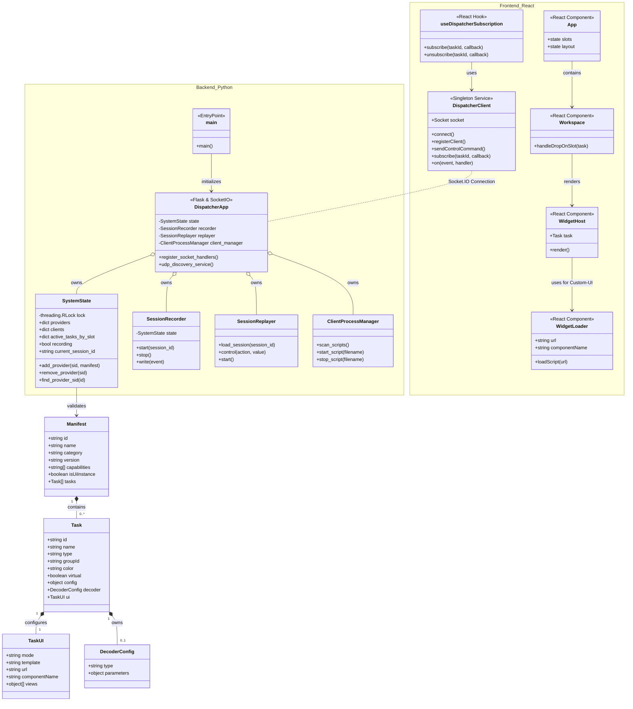

# Architecture & Class Diagram

This document describes the architecture of the E-Lab application, which consists of a Python backend and a React frontend. The system is designed as a distributed application where data sources (providers) and data sinks (UI clients) are decoupled through a central dispatcher.

## Core Architecture Concepts

1. **Dispatcher Pattern**: The Python backend acts as a central dispatcher. It accepts registrations from data providers (e.g., sensors, simulators) and forwards their data streams in real-time to all connected UI clients (web interfaces). Neither the providers nor the clients need to know about each other.

2. **Manifest-based Registration**: Each provider describes its capabilities through a `Manifest` (defined in `ManifestSchema.json`). This JSON document lists the tasks (e.g., "measure temperature") that the provider offers, their data types, and how they should be rendered in the UI. This allows the frontend to dynamically build appropriate visualizations for unknown hardware without prior knowledge.

3. **Remote UI Injection**: A core feature is the ability for providers to supply their own UI components (in the form of JavaScript files). The React application can load and render these components at runtime. This enables bundling highly specialized UIs directly with the hardware (`ui.mode = "custom"`).

4. **Session Recording & Replay**: The dispatcher can record all communication (data streams, commands, registrations) to a session file (SQLite). These sessions can be loaded and played back at a later time, with the system behaving as if the original providers were connected live.

5. **Decoupled Components**: Both the backend and frontend are divided into clearly defined, reusable modules and classes that are loosely coupled.

## Class & Component Diagram

The following diagram shows the most important classes, components, and data structures of the system.

## Structure Analysis

### Data Structures (`Manifest` & `Task`)

These structures, defined by `ManifestSchema.json`, are the "API contract" of the system.

- **Manifest**: Represents a provider (e.g., a physical device). It contains metadata and a list of `Tasks` that the device can perform.
- **Task**: Represents a single capability, e.g., a measurement channel or an actuator. It defines the data type (`SENSOR`, `ACTUATOR`), configuration parameters (`config`), and most importantly the UI representation (`ui`).
- **TaskUI**: Defines how a task is visualized in the frontend. The `mode` ("generic" or "custom") determines whether a standard template or a dynamically loaded component is used.

### Backend (Python)

The backend is a `Flask` application with `Flask-SocketIO` for real-time communication.

- **`main`**: The entry point that initializes all backend services and starts the server.
- **`DispatcherApp`**: The heart of the application (spread across `app.py` and `sockets.py`). It orchestrates the various services. The actual logic is implemented in the socket handlers in `sockets.py`. It starts the `udp_discovery_service` in a separate thread.
- **`SystemState`**: A class that manages the state of the entire system in a thread-safe manner (connected providers, UI clients, active tasks). The use of `threading.RLock` is essential to prevent race conditions during concurrent access.
- **`SessionRecorder`**: When a recording is started, this service writes all relevant events (new providers, data packets, commands) to a `session.sqlite` database.
- **`SessionReplayer`**: This service can load a `session.sqlite` file and replay the stored events with correct timing. To the frontend, it appears as if the recorded devices are connected live.
- **`ClientProcessManager`**: A helper service that can start and stop external Python scripts (acting as E-Lab clients) as separate processes.

### Frontend (React)

The frontend is a modern React application built with Vite.

- **`DispatcherClient`**: A service exported as a singleton that encapsulates all Socket.IO communication with the backend. React components do not interact directly with the socket, but use the methods of this client (e.g., `sendControlCommand`, `subscribe`). This decouples the UI from the network logic.
- **`useDispatcherSubscription`**: A React hook that hides the complexity of subscribing to task data streams. It internally uses the `DispatcherClient` to bind a component to a specific `taskId` and handles automatic subscription/unsubscription.
- **`App` / `Workspace`**: The main components that manage the application layout (sidebar, grid system). The `Workspace` is responsible for placing tasks on widget slots via drag & drop.
- **`WidgetHost`**: A crucial component that receives a `Task` object as a prop and renders the appropriate visualization for it.
