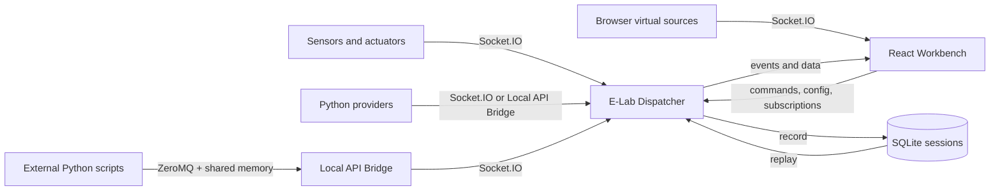
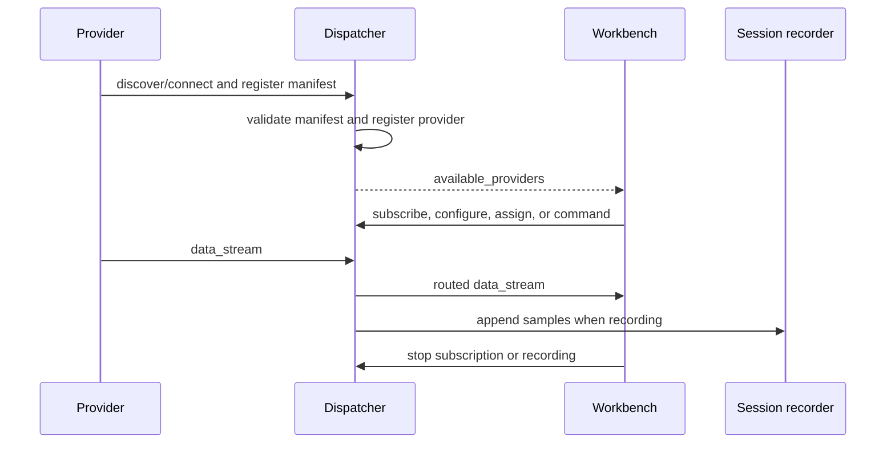
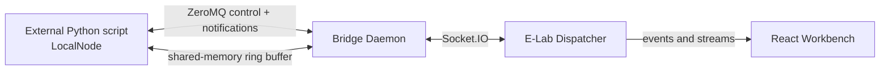
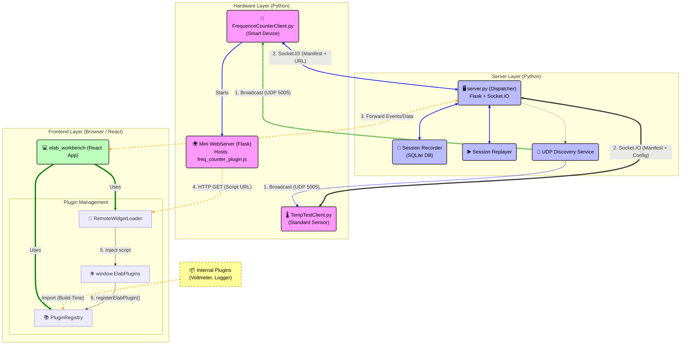

# E-Lab Architecture Overview

E-Lab is a distributed IoT measurement laboratory. It connects physical
sensors and actuators, Python providers, browser-based virtual sources, and a
React workbench through one dispatcher. The system is designed around a
provider/consumer split:

- **Providers** produce measurements, expose actuator commands, or implement
    processing tasks.
- **The dispatcher** registers providers, routes data and commands, manages
    configuration, records sessions, and coordinates security.
- **Consumers** such as the workbench, external scripts, and replay sessions
    subscribe to or process the resulting streams.

The core principle is that data production is independent from visualization.
A sensor may continue producing data even when no widget is currently visible;
the workbench controls which streams are forwarded to which consumers.

## System at a Glance



### Main Components

| Component | Location | Responsibility |
|---|---|---|
| Dispatcher | `server.py`, `elab_server/` | Flask/Socket.IO server, provider registry, routing, state, auth, recording, replay |
| Workbench | `elab_workbench/` | React/Vite UI for device discovery, widgets, subscriptions, commands, sessions, and plugins |
| Local API Bridge | `elab_bridge/` | Local ZeroMQ gateway between external scripts and the dispatcher |
| Python Bridge API | `elab_api/` | `LocalNode`, task registration, callbacks, shared-memory streaming, commands, and history access |
| Core clients | `elab_clients_core/python/` | Public Python and ESP32 client implementations |
| Premium clients | `elab_clients_premium/` | Private or commercial client implementations and assets |
| Manifest schema | `schemas/ManifestSchema.json` | Contract for providers, devices, tasks, UI metadata, decoders, and configuration |

## Runtime Architecture

The dispatcher is the central coordination point. Providers do not need to
know which widgets consume their data, and widgets do not need to know how a
sensor is implemented.



### Provider Registration

Every provider sends a manifest describing its identity and tasks. A manifest
normally contains:

- a stable provider ID and display name;
- a `device` block with device ID, model, identity anchor, firmware version,
    and persistence capability;
- a provider category such as `HARDWARE`, `VIRTUAL_INTERNAL`, or
    `VIRTUAL_SCRIPT`;
- one or more tasks of type `SENSOR`, `ACTUATOR`, `MATH`, `MEASURE`, `CONTROL`,
    or `GENERATOR`;
- UI metadata such as a generic template, custom plugin URL, configuration
    fields, actions, tags, and units;
- optional decoder metadata for binary payloads.

The manifest is the contract between a provider and the dispatcher/workbench.
The canonical schema is [ManifestSchema.json](../schemas/ManifestSchema.json).
The practical task and UI vocabulary is documented in
[schema_reference.md](schema_reference.md) and
[template_reference.md](template_reference.md).

### Provider and Device Identity

A device may expose several providers. Providers from the same physical or
logical device share the device identity and, when authentication is enabled,
one pairing credential. Device identity anchors include `efuse_mac`, `serial`,
`ble_mac`, `assigned`, and `ephemeral`. Stable anchors survive restarts;
ephemeral identities are session-scoped.

## Discovery and Connection Flow

The default zero-configuration path is:

1. The dispatcher broadcasts its service information over UDP.
2. A client discovers the dispatcher address and connects through Socket.IO.
3. The client sends its manifest with `register_provider`.
4. The dispatcher validates and registers the provider, or places it in a
     pending state when operator approval is required.
5. The workbench receives the provider list and creates the appropriate task
     entries.

Discovery is optional. Clients can connect to a known dispatcher address, and
the discovery service can be disabled in restrictive networks. See
[deployment.md](deployment.md) and the discovery controls in
[security.md](security.md).

## Data and Control Planes

E-Lab uses separate paths for control and measurement data:

| Plane | Transport | Typical messages | Design goal |
|---|---|---|---|
| Control | Socket.IO or ZeroMQ control channel | Registration, subscriptions, configuration, commands, heartbeats | Reliable coordination and state changes |
| Notification | Socket.IO or ZeroMQ publish/subscribe | Configuration changes, input assignments, stream notifications | Asynchronous updates |
| Data | Socket.IO payloads or shared-memory ring buffers | Measurement chunks and replay samples | Efficient streaming with source timestamps preserved |

The server routes data without making the provider responsible for widget
state. A provider keeps producing its data; subscribing or removing a widget
changes forwarding to consumers rather than silently stopping the source.

## Local API Bridge

External Python scripts can use the Local API Bridge instead of implementing a
direct Socket.IO client:



The bridge provides:

- `LocalNode.register_task()` and `register_math_task()` for manifest tasks;
- `on_config_update()`, `on_input_update()`, `on_stream()`, and
    `on_dynamic_stream()` callbacks;
- NumPy publishing through shared memory;
- actor commands and historical data access;
- explicit `DeviceDefinition` support for stable device identity.

The bridge is a runtime/data integration layer, not a UI plugin system. A
JavaScript plugin runs in the workbench browser and only controls task
presentation. It does not connect directly to ZeroMQ or shared memory. See
[local_api_bridge.md](local_api_bridge.md) and
[python_api_reference.md](python_api_reference.md).

## Workbench and Plugin Integration

The workbench supports both built-in and remotely loaded UI components:

- **Generic widgets** use task templates and configuration fields already
    shipped with the workbench. They are the default choice for most sensors and
    actuators.
- **Internal plugins** are bundled in the workbench and registered at build
    time.
- **Remote plugins** are JavaScript files served by a provider and loaded at
    runtime when a task uses `ui_mode="custom"`. The dispatcher forwards the
    manifest; the browser loads the approved script URL.

Remote plugin code runs with the workbench's privileges. Plugin URLs therefore
use origin allow-lists and optional Subresource Integrity. Do not load plugin
code from an untrusted third-party CDN. See
[plugin_development.md](plugin_development.md) and
[security.md](security.md).

The diagram below shows the plugin paths in more detail:



### Explanation of Component Relationships

1. **Hardware Clients (Python)**

    - **Smart Device (e.g., Frequency Counter):** It is more than just a sensor. It starts its own small Flask web server (see `run_dispatcher_mode` / `run_standalone_mode` in `FrequenceCounterClient.py`) that serves a JavaScript file (`assets/freq_counter_plugin.js`). In the manifest it sends to the server, the address of this script is specified under `ui.url`.

    - **Standard Sensor (e.g., TempSensor):** Uses standard templates (e.g., `tpl_metric`) that are already built into the frontend. It does not need to host its own code.

2. **Server (Dispatcher)**

    - It acts as a mediator. It does not store the plugins itself, but simply forwards the manifests (including the plugin URLs) to the frontend (`available_providers` event).

3. **Frontend (Workbench)**

    - **Internal Plugins:** Are permanently integrated during compilation (`npm run build`). `PluginRegistry.jsx` collects all files from the `plugins/` folder.

    - **External Plugins (Remote Injection):** The `RemoteWidgetLoader` detects that a device is using `custom` mode. It dynamically creates an HTML `<script>` tag with the URL of the hardware client. The loaded script executes `window.registerElabPlugin` and passes its React code to the frontend.

## Security and Trust Boundaries

Provider authentication uses Trust on First Use (TOFU) pairing plus
HMAC-SHA256 signatures for external provider data streams:

1. A provider registers its manifest and device identity.
2. Unknown devices or changed manifests enter `pending`.
3. An operator approves the exact manifest shown by the workbench.
4. The dispatcher sends a generated secret once.
5. The provider signs each subsequent `data_stream` payload.

The manifest hash binds approval to the provider definition. A device identity
can be shared by multiple providers from the same physical unit, while an
`ephemeral` identity is valid only for the current session. The design provides
authenticity and tamper detection, not payload confidentiality; use TLS when
measurement data must be encrypted in transit.

There are two intentional trusted paths:

- UI-internal virtual providers originate in the trusted workbench session and
    bypass external-provider TOFU/HMAC checks.
- Locally spawned scripts can receive a one-shot auto-approval token from the
    process manager. The token is consumed once and is not a general-purpose
    replacement for device credentials.

See [security.md](security.md) for the protocol, event reference, migration
guidance, and operational troubleshooting.

## Sessions, Recording, and Replay

The dispatcher can record routed measurement streams into SQLite session files.
Recording preserves source IDs, timestamps, session metadata, and per-source
time quality. Replay reads those recordings without changing the original
session files and presents them on the current server wall-clock axis.

Live and replay sources remain separate providers with separate source IDs and
buffers. This makes it possible to compare a historical measurement with a
live source without merging their data accidentally. The session format and
state transitions are described in [classes.md](classes.md) and [api.md](api.md).

## Choosing an Integration Path

| Need | Recommended path |
|---|---|
| Physical sensor or actuator with direct Socket.IO access | Implement a client using the manifest contract and the relevant client helpers |
| External Python process with callbacks, NumPy streaming, or shared memory | Use `elab_api.LocalNode` with the Local API Bridge |
| Built-in browser visualization | Add a generic template or internal workbench plugin |
| Device-specific browser visualization | Register a secured remote JavaScript plugin with `ui_mode="custom"` |
| Browser-only simulation or virtual source | Use the workbench's internal provider path |
| Offline comparison or regression analysis | Record a session and use replay/history APIs |

The Python Bridge API and a JavaScript UI plugin solve different problems: the
Python process produces or transforms data; the plugin renders a task in the
browser. A custom UI does not replace a provider process.

## Repository Map

```text
E-Lab/
├── server.py                     Dispatcher entry point
├── elab_server/                  Backend state, routing, auth, sessions
├── elab_bridge/                  Local API Bridge daemon
├── elab_api/                     Public LocalNode Python API
├── elab_clients_core/            Public Python and ESP32 clients
├── elab_clients_premium/         Premium/private clients and assets
├── elab_workbench/               React/Vite frontend
├── schemas/                      Provider and task manifest schemas
├── tests/                        Backend and integration tests
├── doc/                          Architecture and API documentation
└── tools/                        Documentation and repository tooling
```

Useful entry points:

- [Local API Bridge guide](local_api_bridge.md) for external Python scripts.
- [Plugin development guide](plugin_development.md) for generic and custom UI.
- [API reference](api.md) for Socket.IO events and payloads.
- [Schema reference](schema_reference.md) for manifest and task fields.
- [Security guide](security.md) for pairing and signed data streams.
- [Installation guide](install.md) for local development and deployment.

## Getting Started

For a local development setup:

```bash
# Backend dependencies
pip install -r requirements.txt

# Start the dispatcher
python server.py

# In another terminal, install and start the workbench
cd elab_workbench
npm install
npm run dev
```

To connect an external Python script, install the project package and start
the bridge daemon before starting the script:

```bash
pip install -e .
python -m elab_bridge.bridge_daemon --dispatcher-url http://127.0.0.1:5000
```

The smallest Bridge API client is:

```python
from elab_api import LocalNode

node = LocalNode(name="Example script")
node.register_task("example_sensor", task_type="SENSOR")
node.run()
```

Before contributing, run the backend tests with `pytest -q` and the frontend
tests with `npm test --prefix elab_workbench`. The test strategy is documented
in [test.md](test.md).

## Time Model

E-Lab separates the **time anchor** from the **time resolution** of a signal.
The Dispatcher is the authority for the anchor, not for the resolution:

- The Dispatcher maps every incoming source onto its server wall clock so
    streams from different providers share one reference time.
- A provider that sends absolute Unix epoch milliseconds keeps its timestamps.
- A provider that sends a device-local clock, such as `millis()`, receives a
    stable per-source offset. The Dispatcher shifts the timestamps, but does not
    resample, round, or regenerate them.
- `startTime`, `endTime`, and `timestamps[]` therefore retain the source's
    internal sample spacing and chunk duration. Network delivery time is not
    substituted for the measurement time.

The resulting live path is:

```text
device timestamp -> dispatcher source offset -> server-wall-clock data_stream
```

The offset is cached per source and corrected only when the source drifts
significantly. This gives the UI a common time axis while preserving the
highest time detail the source supplied. It does not guarantee perfect
cross-device synchronization: device clock quality, network delay, and the
server anchoring method define the alignment limit. The recorded quality is
stored in `session_sources.time_source` as `device` or `server`.

## Recording and Replay Time

Recordings are stored in `session.sqlite` with absolute epoch timestamps. They
are independent of the time at which they are later opened. The replay cursor,
slider, seek position, and duration use a separate session-relative axis:

```text
session time:     0 ms ------------------------------> duration
wall-clock replay:      recording is presented as if it happened now
```

During playback, the current replay position is shifted onto the current
server wall clock. The relative distances between samples remain unchanged,
so a replayed sensor behaves like a source producing data now. This allows a
recording to be displayed beside a live virtual source such as the Sinus
Generator. Recorded and live sources still use separate source IDs and buffers;
the common wall-clock axis is what makes intentional mixing possible without
accidentally merging the streams.

Session metadata in `session_meta` stores the schema version, origin, creation
time, and authoritative session start/end. Older sessions without this table
fall back to the minimum and maximum event timestamps. `session_sources`
stores the time quality of each recorded source. See [API Time Semantics](api.md#time-semantics) and [Session File Layout](classes.md#session-file-layout-sessionsqlite).

### Composition of Multiple Recordings

Future multi-session editing should follow a video-editor model:

1. Place source tracks from different sessions on one project-relative
     timeline.
2. Apply offsets to the tracks in the editor to align them.
3. Save or export the aligned result as a new composed session with one
     authoritative time axis.

Track offsets belong to this edit state, not to the live/replay wall-clock
     conversion. Once exported, the composed session should replay through the
     normal single-session path. Sources imported from different sessions need
     collision-free IDs, especially when the same physical sensor appears more
     than once.
